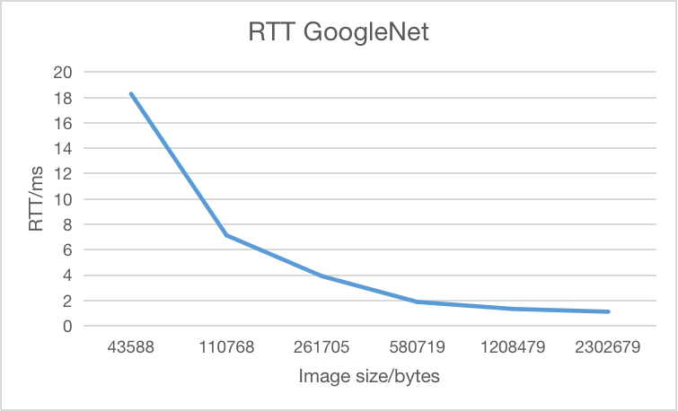

# CS655 Final Project

### Collaborators
Taoyu Chen, mirack@bu.edu, U82740711
Haocheng Zhao, zhaohc@bu.edu, U59767736
Jun Zhu, zhujun99@bu.edu, U78975626


## Problem Statement/Introduction
### Definition
Image Recognition Application
The project involves creating a web-based image recognition service that allows users to submit an image and receive a classification answer using some image recognition techniques. The service will utilize pre-trained neural networks, here with SqueezeNet or GoogleNet, and will connect the web interface to the recognition systems using Python socket programming. The web interface and recognition systems will be on separate nodes, one on client part and the other on server part, allowing for efficient and scalable processing of image queries.
### Motivation
The motivation behind the use of socket programming in this project is to establish a reliable and efficient communication network between the web interface and the recognition system. This network will ensure that image queries submitted through the web interface are quickly and accurately processed by the recognition system, providing users with accurate results in a timely manner. The use of a network in this way will also allow for scalable performance, allowing the service to handle a high volume of image queries without compromising on accuracy or speed.
In addition to providing a user-friendly tool for image identification, we will also conduct experiments to test the real-time performance of the communication network in terms of round-trip time (RTT) and throughput. These experiments will involve testing the network with different image sizes to evaluate its ability to handle a range of image queries efficiently. The results of these experiments will provide valuable insights into the performance of the network and will help to identify any potential bottlenecks or limitations. This will ultimately improve the overall performance and user experience of the image-recognition service.


## Code Design/Setup
### BackEnd
In the BackEnd part. It  is mainly consisted of 2 parts in a C/S model. In the client part, it is little different from the programming project 1. It sends file head which contains the basic information of the file to the server, in this way, server can build file to receive it. And the client send file to server in a fixed buffer size. During this process, it save start time and end time of the computer and compute the RTT of it. Save all the rtt in a List named result and compute average rtt after sending. At last, save it in csv file.
While in the server part, it receives the file and save it. Then we use pytorch to get pre-trained model like squeezenet and googlenet. We set model we need using type. And we put the image we get into the model and get the result of it. And we sort the result, and build a string which contains top 5 result of the image to the client. And we keep the server running.
### FrontEnd
For front-end design, using HTML and CSS to build front-end UI Web pages, along with using Flask in python as a web framework. With the flask framework, it is able to deploy the front-end as a separate service and set the access path of different methods in the service through '@app.route'.
The running process of the whole project is that first the user uploads an image on the front-end web page, then the front-end service calls the remote back-end service through Restful API, and displays the result returned by the back-end service on the page again, thus completing the whole interaction process.
<div align=center></div>

## Experiment/Analysis
### Configs/Working Environment
GENI env
|Packages  | Version |
|---|---|
For backEnd:
|python| 3.8.0|
|pytorch|1.13.0+cpu|
For frontEnd:
|pandas |1.5.2|
|opencv-python   |4.6.0.66|
|flask |2.2.2|
<div align=center></div>

For each data point on diagrams, we send the images 5 times and calculate the average.
The data can refer to the `.csv` files in our nodes.

### squeezeNet
RTT with different img sizes
<div align=center></div>
RTT is surprisingly down when size goes up. This should be caused by the way RTT is calculated. We calculate RTTs using average time, so when dealing with small data we spend some time on connection, and the average is high.


TotalDelay with different img sizes
<div align=center></div>
Total time of the c/s process is as expected. When the pics sizes goes up the time up too. 


Throughput with different img sizes
<div align=center></div>
The throughput is going up as the pics become larger. So we guess socket has a good range of throughput and we have not met its upper bound. 

### googleNet
RTT with different img sizes
<div align=center></div>
RTT is surprisingly down when size goes up. This should be caused by the way RTT is calculated. We calculate RTTs using average time, so when dealing with small data we spend some time on connection, and the average is high.

TotalDelay with different img sizes
<div align=center></div>
Total time of the c/s process is as expected. When the pics sizes goes up the time up too. 


Throughput with different img sizes
<div align=center></div>
The throughput is going up as the pics become larger. So we guess socket has a good range of throughput and we have not met its upper bound. 


## Working Demo Video
Video
https://drive.google.com/file/d/1WE9u8uBdWbU1fVBbIUd8wa_CXrrPxIIX/view?usp=share_link
Codes
https://github.com/mirackk/CVwithSocket


## Reproducibility
### Scripts to setup the experiment
We suggest that using the reserved GENI nodes we provid so We can not care about the environment problems. If you want to run the experiment all over again please stop the backgorund process. `ps -ef | grep Server`, `ps -ef | grep Client`, `ps -ef | grep app` to find PID and kill all the relative processes. 

1. First reserve resources on GENI, we need 2 nodes and 1 link linking them.
2. Clone the code on git or the nodes we created, then scp all of them on both nodes.
3. Get all environment ready. python3.8, pip3, pytorch 1.13.0+cpu, pandas, opencv-python, flask.
You might need to do `sudo apt update` or `pip3 install update pip` first.
(Using conda would be a good idea too, but we only want one version of python so we install it in the origin space)

### Instructions to reproduce experiment
After environment setup, the rest can refer to working demo video.
If there is any problem on environment setup (which I have a lot), just use our nodes to run the experiment or contact mirack@bu.edu. 
In Server.py, modify the parameter (line 19) `type` to be "squeezenet" or "googlenet". Server should bind `0.0.0.0`
In Client.py, modify the patameter (line 60) `measurement` to be "rtt" or "tput" for testing RTT or throughput. Client must connect to server's interface like `10.10.1.1`
In app.py, modify last line to set public port (app.run( )). 
Must put client and frontEnd in the same machine.
1. Open 3 termianls, one for server, one for client, one for front end
2. In SourceFiles/backend, run python3 Server.py
3. In SourceFiles/backend, run python3 Client.py
4. In SourceFiles/flaskProject, run python3 app.py
5. In the termianl of frontend one, it will show you the public IP address you can visit.
6. Use the IP address to submit images.
7. The result of experiment will be written down on where Client.py is as a `csv` file.

If you want to use the images we used can go check `flaskProject/static/images/`
In fact our web service is always running until the GENI resouces dead.
Click `http://128.163.233.180:8900/`

### Code and code quality
Please refer to github for the origin code (or vim them on the GENI nodes)
https://github.com/mirackk/CVwithSocket
backend/Server.py
backend/Client.py
flaskProject/app.py

### Rspec files
```
<rspec xmlns="http://www.geni.net/resources/rspec/3" xmlns:emulab="http://www.protogeni.net/resources/rspec/ext/emulab/1" xmlns:tour="http://www.protogeni.net/resources/rspec/ext/apt-tour/1" xmlns:jacks="http://www.protogeni.net/resources/rspec/ext/jacks/1" xmlns:xsi="http://www.w3.org/2001/XMLSchema-instance" xsi:schemaLocation="http://www.geni.net/resources/rspec/3    http://www.geni.net/resources/rspec/3/request.xsd" type="request">
  <node xmlns:emulab="http://www.protogeni.net/resources/rspec/ext/emulab/1" client_id="server" component_manager_id="urn:publicid:IDN+mcv.sdn.uky.edu+authority+cm" component_id="urn:publicid:IDN+mcv.sdn.uky.edu+node+pc2" sliver_id="urn:publicid:IDN+mcv.sdn.uky.edu+sliver+79154" exclusive="false">
    <icon xmlns="http://www.protogeni.net/resources/rspec/ext/jacks/1" url="https://portal.geni.net/images/VM-noTxt-centered.svg"/>
    <routable_control_ip xmlns="http://www.protogeni.net/resources/rspec/ext/emulab/1"/>
    <sliver_type name="default-vm"/>
    <services>
      <login authentication="ssh-keys" hostname="pcvm2-22.mcv.sdn.uky.edu" port="22" username="mirack"/>
      <login authentication="ssh-keys" hostname="pcvm2-22.mcv.sdn.uky.edu" port="22" username="ctony"/>
      <login authentication="ssh-keys" hostname="pcvm2-22.mcv.sdn.uky.edu" port="22" username="lei"/>
      <login authentication="ssh-keys" hostname="pcvm2-22.mcv.sdn.uky.edu" port="22" username="matta"/>
      <emulab:console server="pcvm2-22.mcv.sdn.uky.edu"/>
      <emulab:imageable available="true"/>
    </services>
    <interface client_id="interface-0" component_id="urn:publicid:IDN+mcv.sdn.uky.edu+interface+pc2:lo0" sliver_id="urn:publicid:IDN+mcv.sdn.uky.edu+sliver+79157" mac_address="0265b6205ad1">
      <ip address="10.10.1.1" netmask="255.255.255.0" type="ipv4"/>
    </interface>
    <emulab:vnode name="pcvm2-22" hardware_type="pcvm" disk_image="emulab-ops/UBUNTU18-64-STD:0"/>
    <host name="server.CS655FinalPJNew.ch-geni-net.mcv.sdn.uky.edu" ipv4="128.163.233.181"/>
  </node>
  <node xmlns:emulab="http://www.protogeni.net/resources/rspec/ext/emulab/1" client_id="client" component_manager_id="urn:publicid:IDN+mcv.sdn.uky.edu+authority+cm" component_id="urn:publicid:IDN+mcv.sdn.uky.edu+node+pc2" sliver_id="urn:publicid:IDN+mcv.sdn.uky.edu+sliver+79153" exclusive="false">
    <icon xmlns="http://www.protogeni.net/resources/rspec/ext/jacks/1" url="https://portal.geni.net/images/VM-noTxt-centered.svg"/>
    <routable_control_ip xmlns="http://www.protogeni.net/resources/rspec/ext/emulab/1"/>
    <sliver_type name="default-vm"/>
    <services>
      <login authentication="ssh-keys" hostname="pcvm2-21.mcv.sdn.uky.edu" port="22" username="mirack"/>
      <login authentication="ssh-keys" hostname="pcvm2-21.mcv.sdn.uky.edu" port="22" username="ctony"/>
      <login authentication="ssh-keys" hostname="pcvm2-21.mcv.sdn.uky.edu" port="22" username="lei"/>
      <login authentication="ssh-keys" hostname="pcvm2-21.mcv.sdn.uky.edu" port="22" username="matta"/>
      <emulab:console server="pcvm2-21.mcv.sdn.uky.edu"/>
      <emulab:imageable available="true"/>
    </services>
    <interface client_id="interface-1" component_id="urn:publicid:IDN+mcv.sdn.uky.edu+interface+pc2:lo0" sliver_id="urn:publicid:IDN+mcv.sdn.uky.edu+sliver+79158" mac_address="0283b64b464c">
      <ip address="10.10.1.2" netmask="255.255.255.0" type="ipv4"/>
    </interface>
    <emulab:vnode name="pcvm2-21" hardware_type="pcvm" disk_image="emulab-ops/UBUNTU18-64-STD:0"/>
    <host name="client.CS655FinalPJNew.ch-geni-net.mcv.sdn.uky.edu" ipv4="128.163.233.180"/>
  </node>
  <link client_id="link-0" sliver_id="urn:publicid:IDN+mcv.sdn.uky.edu+sliver+79156">
    <interface_ref client_id="interface-0" component_id="urn:publicid:IDN+mcv.sdn.uky.edu+interface+pc2:lo0" sliver_id="urn:publicid:IDN+mcv.sdn.uky.edu+sliver+79157"/>
    <interface_ref client_id="interface-1" component_id="urn:publicid:IDN+mcv.sdn.uky.edu+interface+pc2:lo0" sliver_id="urn:publicid:IDN+mcv.sdn.uky.edu+sliver+79158"/>
    <component_manager name="urn:publicid:IDN+mcv.sdn.uky.edu+authority+cm"/>
  </link>
  <rs:site_info xmlns:rs="http://www.protogeni.net/resources/rspec/ext/site-info/1">
    <rs:location country="" latitude="38.0354447" longitude="-84.5056878"/>
  </rs:site_info>
</rspec>
```